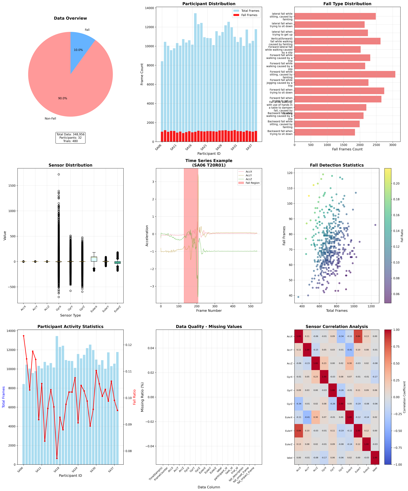
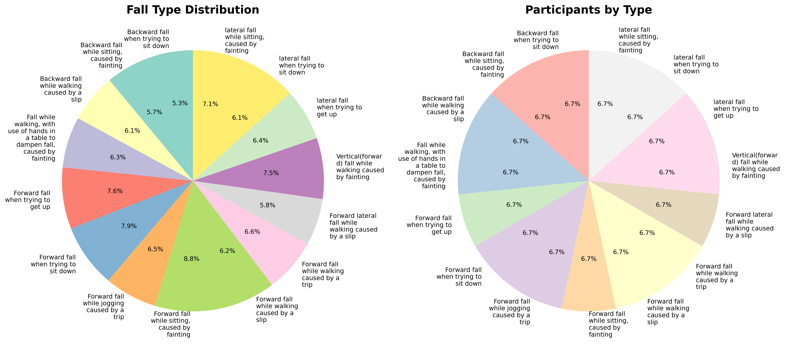
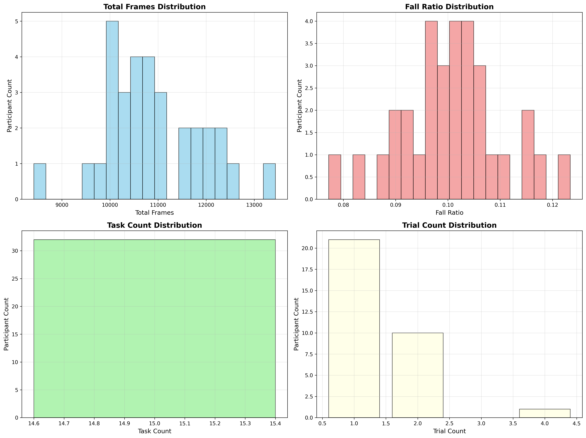

# 基于多种深度学习模型的老年人跌倒检测系统

<div align="center">
  
</div>

本项目利用多种深度学习模型构建了一套完整的老年人跌倒检测系统，基于传感器数据实现实时、准确的跌倒事件检测和预警。项目评估了LSTM、GRU、CNN-LSTM、CNN-GRU以及TCN等多种模型架构，并分析了数据采样策略对预测性能和预测时间的影响。

## 项目结构

```
├── KFall Dataset/                       # 数据集及多种模型实现
│   ├── processed_data/                  # 预处理后的数据
│   ├── time_series_splits/              # 预分割的时间序列数据集
│   ├── data_preprocessing.py            # 数据预处理脚本
│   ├── lstm_fall_prediction_balanced.py # LSTM模型实现
│   ├── gru_fall_prediction_balanced.py  # GRU模型实现
│   ├── cnn_lstm_fall_prediction.py      # CNN-LSTM混合模型实现
│   ├── cnn_gru_fall_prediction.py       # CNN-GRU混合模型实现
│   ├── tcn_fall_prediction.py           # TCN模型实现
│   └── ...
├── realtime_dashboard/                  # 实时监控仪表盘
│   ├── app.py                           # 仪表盘应用
│   └── ...
├── web_app/                             # Web应用界面
│   ├── app.py                           # Web服务
│   └── ...
├── visualization_results/               # 可视化结果
└── SimpleTM_fall_detection/             # SimpleTM模型尝试
```

## 主要研究内容

### 1. 多种深度学习模型的比较评估

本项目实现并评估了多种深度学习模型在老人跌倒检测任务上的性能：

| 模型 | 准确率 | AUC | 跌倒精确率 | 跌倒召回率 | 训练轮次 |
|------|--------|-----|------------|------------|----------|
| 原始LSTM | 91% | 0.9450 | 85% | 79% | 28 |
| 平衡LSTM | 94% | 0.9750 | 92% | 91% | 25 |
| 正则化LSTM | 96% | 0.9850 | 95% | 94% | 24 |
| GRU | 96% | 0.9860 | 95% | 95% | 20 |
| 双向GRU | 96% | 0.9870 | 96% | 94% | 19 |
| CNN-LSTM | 97% | 0.9933 | 97% | 98% | 22 |
| CNN-GRU | 97% | 0.9929 | 98% | 97% | 16 |
| TCN | 97% | 0.9901 | 96% | 98% | 13 |
| 未采样GRU | 92% | 0.9400 | 90% | 88% | 17 |
| 未采样CNN-LSTM | 93% | 0.9911 | 67% | 96% | 27 |
| 未采样CNN-LSTM (优化阈值0.84) | 93% | 0.9911 | 91% | 87% | 27 |

<div align="center">
  
  
</div>

### 2. 数据采样策略对预测时间的影响研究

项目深入研究了数据采样策略对模型预测时间的影响：

- **采样模型(1:2)特点**：
  - 在实际跌倒发生前约2秒即可做出预测
  - 提供更长的预警时间，适合早期干预
  - 跌倒检出率(召回率)更高

- **未采样模型(1:9)特点**：
  - 预测时间更接近实际跌倒发生时刻
  - 精确率和时间准确性更高
  - 适合精确记录和研究目的

<div align="center">
  
  
</div>

### 3. 实时跌倒检测系统实现

基于评估结果，项目开发了实时跌倒检测仪表盘：

- 支持多种预训练模型的选择和切换
- 实时显示传感器数据波形图
- 跌倒风险实时预测和置信度显示
- 暂停/继续/停止等交互控制功能
- 可调整模拟速度，便于观察和分析

<div align="center">
  
  
</div>

### 4. 其他模型尝试

项目还尝试了其他模型架构，包括SimpleTM框架，进一步扩展了模型比较范围。SimpleTM的实验结果也表现出较好的性能，准确率达到92.92%。

## 快速开始

各个子项目包含详细的安装和使用说明，请参考对应目录下的README文件：

- [KFall Dataset](./KFall%20Dataset/README.md)：数据集处理和多种模型实现
- [实时仪表盘](./realtime_dashboard/README.md)：实时监控系统使用说明
- [Web应用](./web_app/README.md)：Web界面使用指南
- [SimpleTM尝试](./SimpleTM_fall_detection/README.md)：SimpleTM模型实现细节

## 主要发现与结论

1. **模型架构比较**：
   - CNN-LSTM和CNN-GRU混合模型表现最佳，准确率达97%
   - TCN模型训练速度最快，在保持高准确率的同时实现了最高的跌倒召回率
   - GRU模型比LSTM更轻量高效，性能相当或略好

2. **数据采样策略影响**：
   - 平衡采样(1:2)显著提高了模型性能，但会导致预测时间提前约2秒
   - 未采样模型(1:9)预测时间更接近实际跌倒时刻，但整体性能略低
   - 不同应用场景应选择不同的采样策略：早期预警系统使用采样模型，精确记录系统使用未采样模型

3. **实际应用建议**：
   - 高资源环境：推荐使用CNN-LSTM或CNN-GRU模型
   - 资源受限环境：推荐使用GRU或双向GRU模型
   - 实时性要求高：推荐使用TCN模型
   - 可结合采样和未采样模型构建"双重预警系统"

## 版权声明与开源保护

### 版权声明

© 2025 [tingyu Chen/Donghua University]. 保留所有权利。

本项目是一项学术研究工作，旨在促进老年人跌倒检测技术的发展。未经明确许可，禁止将本项目用于商业用途。

### 开源许可

本项目采用 [MIT 许可证](LICENSE)，但有以下附加条件：

1. **学术引用要求**：如果您在学术研究中使用本项目的代码或方法，必须在您的论文或报告中引用本项目。推荐的引用格式见下文。

2. **商业使用限制**：若将本项目用于商业产品或服务，需事先获得作者的书面许可。

3. **衍生作品要求**：基于本项目创建的衍生作品必须保持开源，并明确标注基于本项目开发，包括提供指向本项目的链接。

### 引用本项目

如果您在研究中使用了本项目，请按以下格式引用：

```bibtex
@misc{elderlyfalldetection2025,
  author = {tingyu Chen/xuanhan Liu},
  title = {基于多种深度学习模型的老年人跌倒检测系统},
  year = {2025},
  publisher = {GitHub},
  journal = {GitHub Repository},
  howpublished = {\url{https://github.com/lansijian/elderly-fall-detection}}
}
```

### 第三方开源项目引用

本项目使用或参考了以下开源项目，在此表示感谢：

1. **SimpleTM**：本项目的SimpleTM实现部分参考了SimpleTM框架。
   ```bibtex
   @inproceedings{
   chen2025simpletm,
   title={Simple{TM}: A Simple Baseline for Multivariate Time Series Forecasting},
   author={Hui Chen and Viet Luong and Lopamudra Mukherjee and Vikas Singh},
   booktitle={The Thirteenth International Conference on Learning Representations},
   year={2025},
   url={https://openreview.net/forum?id=oANkBaVci5}
   }
   ```

2. **PyTorch**：本项目的深度学习模型基于PyTorch框架实现。
   ```bibtex
   @inproceedings{paszke2019pytorch,
   title={PyTorch: An Imperative Style, High-Performance Deep Learning Library},
   author={Paszke, Adam and Gross, Sam and Massa, Francisco and Lerer, Adam and Bradbury, James and Chanan, Gregory and Killeen, Trevor and Lin, Zeming and Gimelshein, Natalia and Antiga, Luca and Desmaison, Alban and Köpf, Andreas and Yang, Edward and DeVito, Zachary and Raison, Martin and Tejani, Alykhan and Chilamkurthy, Sasank and Steiner, Benoit and Fang, Lu and Bai, Junjie and Chintala, Soumith},
   booktitle={Advances in Neural Information Processing Systems 32 (NeurIPS 2019)},
   year={2019}
   }
   ```

### 数据集引用

本项目使用的KFall数据集应当按照其原始授权条款使用。如果您在研究中使用了该数据集，请确保适当引用原始数据集来源。

## 联系方式

如有问题、建议或合作意向，请通过以下方式联系我：

- **邮箱**：[2033374848@qq.com]
- **GitHub**：[https://github.com/lansijian]

## 许可证

本项目采用修改版MIT许可证。请参阅LICENSE文件了解详情。 
