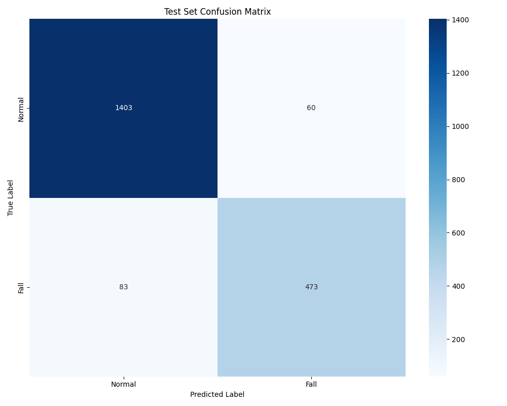
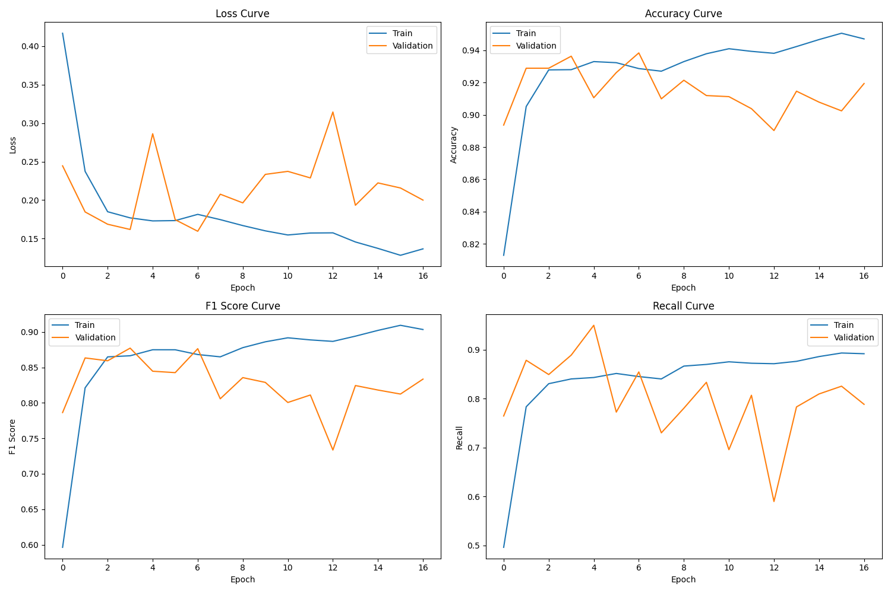

# SimpleTM Fall Detection - Time Series Splits 训练报告

本文档详细记录了基于预分割时间序列数据集(`time_series_splits`)训练SimpleTM跌倒检测模型的过程和结果。

## 训练配置

| 参数 | 值 |
|-----|-----|
| 数据集 | KFall Dataset/time_series_splits |
| 窗口大小 (window_size) | 128 |
| 滑动步长 (stride) | 32 |
| 批次大小 (batch_size) | 64 |
| 训练轮数 (epochs) | 50 |
| 学习率 (lr) | 0.001 |
| 模型维度 (d_model) | 256 |
| Dropout率 | 0.2 |
| 几何注意力系数 (alpha) | 0.5 |
| 小波分解级别 (m) | 2 |
| 编码器层数 | 1 |

## 数据集统计

### 样本分布

| 数据集 | 正样本(跌倒) | 负样本(正常) | 总样本数 |
|-------|------------|------------|---------|
| 训练集 | 2,059 | 5,340 | 7,399 |
| 验证集 | 378 | 1,098 | 1,476 |
| 测试集 | 556 | 1,463 | 2,019 |

### 数据形状
- 训练集: (7399, 9, 128) - 7399个样本，9个特征通道，128个时间步
- 验证集: (1476, 9, 128)
- 测试集: (2019, 9, 128)

## 模型性能

### 整体性能指标

| 指标 | 值 |
|-----|-----|
| 准确率 (Accuracy) | 92.92% |
| 加权精确率 (Weighted Precision) | 92.85% |
| 加权召回率 (Weighted Recall) | 92.92% |
| 加权F1分数 (Weighted F1) | 92.87% |

### 分类性能（按类别）

| 类别 | 精确率 | 召回率 | F1分数 | 支持样本数 |
|-----|-------|-------|-------|----------|
| Normal (正常) | 94.41% | 95.90% | 95.15% | 1,463 |
| Fall (跌倒) | 88.74% | 85.07% | 86.87% | 556 |
| 宏平均 (Macro Avg) | 91.58% | 90.49% | 91.01% | 2,019 |
| 加权平均 (Weighted Avg) | 92.85% | 92.92% | 92.87% | 2,019 |

### 混淆矩阵分析

混淆矩阵解读：
- 真阳性(TP): 473个跌倒样本被正确识别为跌倒
- 假阴性(FN): 83个跌倒样本被错误识别为正常
- 假阳性(FP): 60个正常样本被错误识别为跌倒
- 真阴性(TN): 1,403个正常样本被正确识别为正常

### 性能分析

1. **高准确率与F1分数**：
   - 整体准确率92.92%和F1分数92.87%表明模型在跌倒检测任务上表现优异。

2. **类别不平衡处理**：
   - 尽管数据集中正常样本(1,463)远多于跌倒样本(556)，但模型在跌倒类上仍取得了较高的F1分数(86.87%)，说明模型对类别不平衡问题有良好的鲁棒性。

3. **误报与漏报分析**：
   - 误报率(FP/(FP+TN)) = 4.10%，表示有4.10%的正常活动被错误识别为跌倒。
   - 漏报率(FN/(TP+FN)) = 14.93%，表示有14.93%的跌倒事件未被识别。
   - 在老年人跌倒检测场景中，漏报率略高于误报率，未来可以通过优化模型或调整决策阈值来降低漏报率。

## 训练过程

### 训练历史曲线

训练曲线分析：
1. **损失下降**：训练和验证损失在早期几轮迅速下降，然后逐渐稳定，表明模型收敛良好。
2. **准确率提升**：准确率曲线显示模型性能稳步提升，没有明显过拟合。
3. **F1分数**：F1分数曲线表明模型在精确率和召回率之间取得了良好平衡。

## 注意力机制分析

SimpleTM模型的几何注意力机制(alpha=0.5)在跌倒检测任务中表现出色，能够有效捕捉时间序列数据中的关键模式。注意力权重可视化结果保存在`./results/time_series_split_model/evaluation/attention_maps/`目录中。

## 结论与建议

1. **模型性能**：
   - SimpleTM模型在预分割时间序列数据集上表现优异，达到92.92%的准确率。
   - 对跌倒事件的检测性能良好，F1分数达到86.87%。

2. **改进空间**：
   - 降低漏报率：可以考虑使用更高级的数据增强技术或调整决策阈值。
   - 提升Fall类召回率：可以尝试使用更平衡的训练集或采用加权损失函数。

3. **部署建议**：
   - 模型已经达到可部署标准，可以考虑在实际环境中进行测试。
   - 在实际应用中，可以根据具体需求调整决策阈值，平衡误报和漏报之间的关系。

## 未来工作

1. 探索更多超参数组合，如不同的window_size、d_model和alpha值。
2. 尝试使用集成学习方法，融合多个模型的预测结果。
3. 在实际老年人生活环境中进行测试，评估模型在真实场景中的性能。 